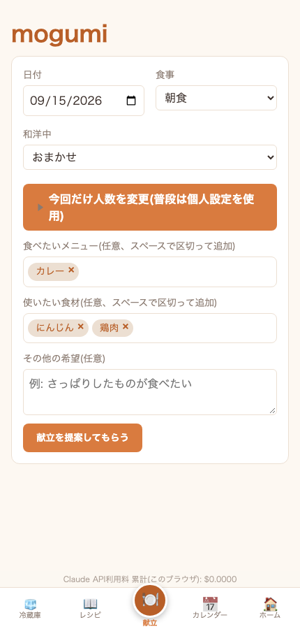
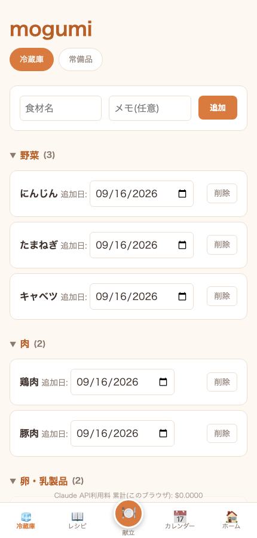
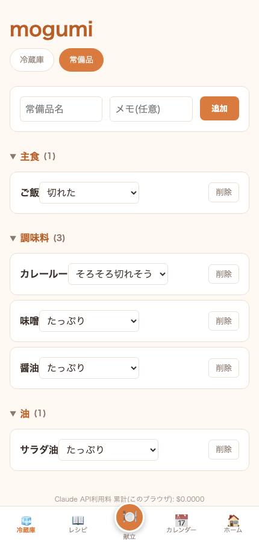
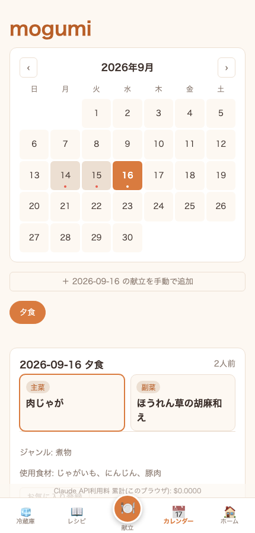
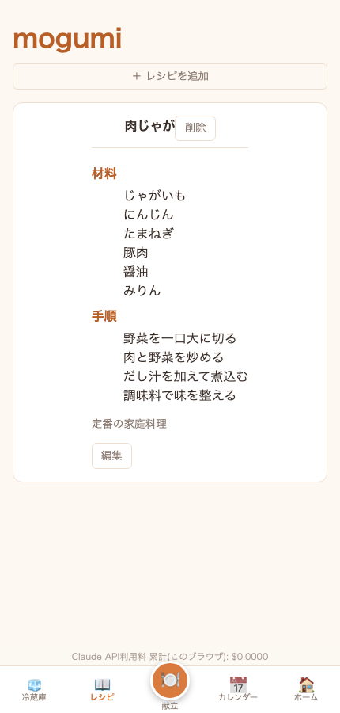

# mogumi

冷蔵庫の中身と直近の献立を踏まえて、Claude(Anthropic API)が主菜・副菜まで含めた**献立ひとそろい**を提案してくれる、個人・家族向けの献立管理アプリです。

単品のレシピを1つ提案するだけのツールではなく、「冷蔵庫にあるものを優先的に使いつつ、最近の献立と被らないように、主菜・副菜・汁物などを組み合わせた1食分」を提案し、そのまま記録・振り返り・レシピ化までできるところまでを一気通貫でカバーしています。

バックエンド(FastAPI + SQLite)とフロントエンド(React + TypeScript)で構成された、セルフホスト前提の個人開発プロジェクトです。

## これは何?

元々は、冷蔵庫の中身をメモしたCSV/JSONを見せながらClaudeとの会話で「今日何作ろう」を相談する、という運用をしていました。そのやり取りをアプリの形にしたのがmogumiです。

- 冷蔵庫・常備品の在庫を管理する
- その在庫と直近の献立履歴をもとに、Claude APIに「献立全体」を提案してもらう
- 提案が気に入ったら記録し、カレンダーで振り返れる
- 気に入ったメニューはレシピとして保存し、後から編集できる

家族(世帯)単位でのデータ共有を想定した設計になっていますが、現状は基本的に個人〜家族内での利用が前提のセルフホストアプリです(不特定多数に公開するSaaSではありません)。

## できること

### 献立提案



「食べたいメニュー」「使いたい食材」をタグで指定したり、和洋中の気分を選んだりしながら、献立全体をClaude APIに提案してもらえます。被り回避は「料理名の完全一致」「ジャンル(カレー/丼など)」「調理法・タンパク源」「和洋中」の4段階で、それぞれの許容日数を個人設定として調整できます。提案が気に入らなければ、微調整リクエストを送ってその場で再生成することもできます。

### 冷蔵庫・常備品の管理




食材を追加すると、名前から自動でカテゴリ(野菜/肉/魚介/調味料など)を判定してグルーピング表示します。常備品は個数管理ではなく「たっぷり/そろそろ切れそう/切れた」というざっくりしたステータスで管理し、献立を記録した直後にまとめて更新できます。

### カレンダーで記録・振り返り



提案してもらった献立、または手動で入力した献立を日付ごとに記録します。メニューはタイルで表示され、選ぶとジャンルや使った食材が見られます。

### レシピ管理



献立の中の気に入った1品を、ワンタップでお気に入りレシピとして保存できます。メニュー自体は記録後に編集しませんが、保存されたレシピは材料・手順を後から自由に編集できます。

## アーキテクチャ

```
mogumi/
├── backend/   FastAPI + SQLite。詳細は backend/README.md
└── frontend/  Vite + React + TypeScript。詳細は frontend/README.md
```

フロントエンドはAPI経由でバックエンドを叩く構成にしており、将来的にモバイルアプリ化する際もバックエンドをそのまま使い回せるようにしています。献立提案のロジックは、バックエンドからClaude APIをtool use(構造化データでの応答を強制する仕組み)で呼び出して生成しています。

## クイックスタート

2つのターミナルでバックエンドとフロントエンドをそれぞれ起動します。

```bash
# ターミナル1: backend
cd backend
python3 -m venv .venv && source .venv/bin/activate
pip install -r requirements.txt
cp .env.example .env  # ANTHROPIC_API_KEY と MOGUMI_SECRET_KEY を設定
python3 -m scripts.create_user  # ログインユーザーを作成
uvicorn app.main:app --reload
```

```bash
# ターミナル2: frontend
cd frontend
npm install
npm run dev
```

`http://localhost:5173` を開いてログインすれば使い始められます。API仕様は `http://127.0.0.1:8000/docs`(Swagger UI、FastAPIが自動生成)を参照してください。データベースの構造は [`backend/docs/data-model.md`](backend/docs/data-model.md)、外部公開に向けたAWS構成案は [`docs/aws-architecture.md`](docs/aws-architecture.md) にまとめています。

公開の新規登録画面はなく、`scripts/create_user.py` からユーザーを作成する運用です(個人・家族利用を想定しているため)。

## 開発状況

主要機能はひととおり実装済みで、日常的に自分たちで使いながら育てています。冷蔵庫・常備品管理、献立提案(段階的な被り回避・微調整・下書き管理込み)、カレンダーでの記録・振り返り、レシピ管理、家族単位でのデータ分離までは実装済みです。iOSアプリ化や、複数人での家族招待フローは未着手です。開発の背景や今後の展望は、詳細を [`backend/README.md`](backend/README.md) / [`frontend/README.md`](frontend/README.md) にまとめています。

## License

[MIT](LICENSE)
