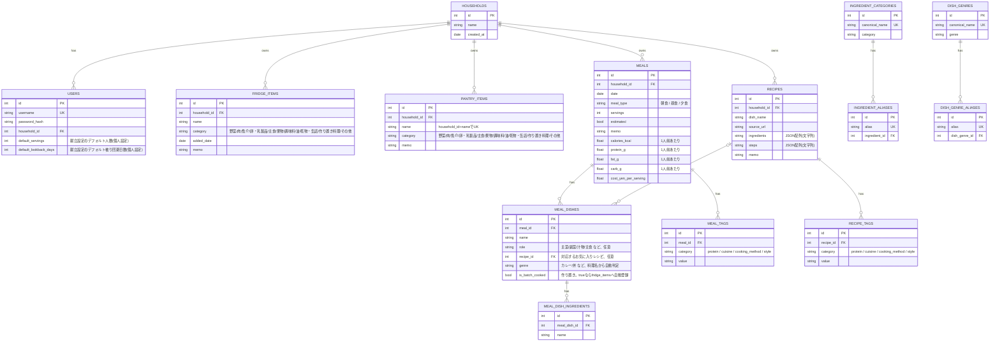

# データモデル

`app/models.py`(SQLAlchemy)で定義しているSQLiteのテーブル定義。コードが正であり、このドキュメントはその要約。フィールドを変更したら、このドキュメントも一緒に更新すること。

## ER図

## テーブル詳細

### households(世帯・共有スコープ)
冷蔵庫・常備品・献立・レシピの「持ち主」の単位。個人利用時も、ユーザー作成時に1人=1世帯を自動作成する(`scripts/create_user.py`)。将来的に家族で共有したくなったら、複数の`users`を同じ`household_id`に束ねるだけでよい設計(2026-09-15〜)。「世帯」は冷蔵庫・パントリー・レシピ・献立記録など**実際に共有される在庫・記録**のみを指すスコープと位置づける(2026-09-15〜、下記`users.default_servings`等の経緯を参照)。

| カラム | 型 | 説明 |
|---|---|---|
| id | int (PK) | |
| name | string | 世帯名(自動生成、例: "aliceの世帯") |
| created_at | date | |

### users(ログインユーザー)
個人利用のみ想定のため、公開の登録エンドポイントはなく`scripts/create_user.py`から作成する。認証(JWT発行・検証)の主体であり、`household_id`を通じて所属する世帯のデータにアクセスする。1ユーザーは1世帯にのみ所属する(複数世帯への同時所属は非対応、必要になれば中間テーブルへの拡張を検討)。

`default_servings`/`default_lookback_days`は献立提案フォームで毎回入力しなくていいように持たせた「個人設定」のデフォルト値。`GET/PUT /api/settings`で参照・更新する。献立提案フォームでは普段はこの値をそのまま使い、必要な時だけ展開して今回だけ上書きできる。当初`households`に持たせていたが(2026-09-15の初期実装)、「被り回避の許容度は明確に個人差がある(小松菜のおひたし連発への不満は個人の体感)」「人数も現状は世帯=1ユーザーなので個人設定で困らない」という指摘から`users`に移動した(同日中に再設計)。「世帯」の概念は実際に共有される在庫・記録に限定し、個人の好みは`users`に置く、という一貫した整理。

| カラム | 型 | 説明 |
|---|---|---|
| id | int (PK) | |
| username | string (unique) | |
| password_hash | string | bcryptハッシュ |
| household_id | int (FK → households.id) | 所属する世帯 |
| default_servings | int | 献立提案のデフォルト人数(既定値2) |
| default_lookback_days | int | 献立提案のデフォルト被り回避参照日数(既定値3) |

### fridge_items(冷蔵庫の中身)
今ある食材のみを保持する(消費履歴は残さない)。使い切ったら行ごと削除する運用。`household_id`が同じユーザー同士で共有される。`category`は追加時に`ingredient_categories`/`ingredient_aliases`を引いて自動設定する(2026-09-15〜、画面でカテゴリごとにグルーピング表示するため)。

| カラム | 型 | 説明 |
|---|---|---|
| id | int (PK) | |
| household_id | int (FK → households.id) | |
| name | string | 食材名(ユーザーが入力した表記そのまま) |
| category | string | `野菜`/`肉`/`魚介`/`卵・乳製品`/`主食`/`果物`/`調味料`/`油`/`乾物・缶詰`/`作り置き料理`/`その他` |
| added_date | date | 追加日 |
| memo | string | 任意メモ |

### ingredient_categories(食材の分類マスター)・ingredient_aliases(表記揺れ)
household非依存(アプリ全体で共有)。`にんじん`/`ニンジン`/`人参`など表記揺れのある食材名を、正規化名1つに対する複数のエイリアスとして持つ。冷蔵庫・常備品どちらに食材/食品を追加する際も、まず`ingredient_aliases.alias`を完全一致で検索し、無ければClaude(Haiku、`app/services/ingredient_categorizer.py`)に1回だけ分類させて結果をここにキャッシュする。よく使う食材・調味料はあらかじめ`SEED_INGREDIENTS`(同ファイル)で登録済み。

| テーブル | カラム | 型 | 説明 |
|---|---|---|---|
| ingredient_categories | id | int (PK) | |
| ingredient_categories | canonical_name | string (unique) | 正規化された食材名(基本ひらがな) |
| ingredient_categories | category | string | `野菜`/`肉`/`魚介`/`卵・乳製品`/`主食`/`果物`/`調味料`/`油`/`乾物・缶詰`/`作り置き料理`/`その他` |
| ingredient_aliases | id | int (PK) | |
| ingredient_aliases | alias | string (unique) | 表記揺れを含む実際の食材名 |
| ingredient_aliases | ingredient_id | int (FK → ingredient_categories.id) | |

注意: 全く新規の同義語同士(例: 種データにない「パクチー」と「香菜」)は、それぞれ独立してLLM分類されるため、正規化名の表記(ひらがな/カタカナ)がずれて別エントリになることがある。カテゴリ自体は毎回正しく判定されるため実用上の問題は小さいが、完全な名寄せは保証しない。

### pantry_items(常備品)
調味料・乾物など、常にある前提のもの。`(household_id, name)`の組み合わせでユニーク制約(世帯ごとに同名アイテムは1つ)。`category`はfridge_itemsと同じ`ingredient_categories`/`ingredient_aliases`マスターを共有して自動設定する(2026-09-15〜)。

| カラム | 型 | 説明 |
|---|---|---|
| id | int (PK) | |
| household_id | int (FK → households.id) | |
| name | string | 常備品名 |
| category | string | `野菜`/`肉`/`魚介`/`卵・乳製品`/`主食`/`果物`/`調味料`/`油`/`乾物・缶詰`/`作り置き料理`/`その他` |
| memo | string | 任意メモ |

### meals(献立記録)
1件が1回の食事(朝食/昼食/夕食)に対応。**栄養・材料費は献立1人前あたりの値**であり、品目ごとの内訳は持たない([`ai-project/menu`](../../menu)の実データ構造(`meals.json`)に合わせた設計)。

| カラム | 型 | 説明 |
|---|---|---|
| id | int (PK) | |
| household_id | int (FK → households.id) | |
| date | date | |
| meal_type | string | `朝食` / `昼食` / `夕食` |
| servings | int | 人前 |
| estimated | bool | 栄養・材料費が概算値かどうか |
| memo | string | |
| calories_kcal / protein_g / fat_g / carb_g | float | 1人前あたりの栄養価 |
| cost_yen_per_serving | float | 1人前あたりの材料費概算 |

### meal_dishes(献立を構成する品目)
`meals`に対する1:N。品目自体は栄養価を持たない(栄養・材料費は`meals`側で献立1人前単位のみ、品目ごとの内訳は意図的に持たない設計 — 過去に品目ごとの栄養値を持たせて手戻りした経緯があり、実際の運用(標準的な食品成分値からの概算を献立単位で行う)に合わせている)。

`role`(主菜/副菜/汁物など)は献立提案(`POST /api/suggestions`)が生成した値をそのまま保存する(2026-09-15〜、以前は記録時に捨てていた)。`recipe_id`は`recipes.dish_name`と名前が完全一致する場合にベストエフォートで自動リンクする(手動指定も可)。名前の言い回しが違うと一致しないため、リンクされないケースは残る。

`genre`は料理名から機械的に判定した大まかなジャンル(カレー/丼/シチューなど)。品目作成時(`POST /api/meals`)に`app/services/dish_genre_classifier.py`の`resolve_genre`で自動設定する(下記`dish_genres`参照)。「キーマカレーもバターチキンカレーも全部カレー」のようにまとめて扱いたい、という要望から追加(2026-09-15〜)。献立の被り回避判定での活用は今後の課題(#24)。

`is_batch_cooked`(作り置き)がtrueの品目は、献立記録時(`POST /api/meals`)に自動的に`fridge_items`へ1件追加される(name=料理名, category=「作り置き料理」, added_date=献立の日付、2026-09-15〜)。ポテサラ等の作り置きは連日でもおかしくないため、タグでの例外ルールではなく実在庫として扱うことで、被り回避ロジック(#24)の対象外に自然に置ける設計(#11・#15での議論の結論)。

| カラム | 型 | 説明 |
|---|---|---|
| id | int (PK) | |
| meal_id | int (FK → meals.id) | |
| name | string | 料理名 |
| role | string (nullable) | `主菜`/`副菜`/`汁物`/`主食` など。提案由来でない場合はNoneもあり得る |
| recipe_id | int (FK → recipes.id, nullable) | 対応するお気に入りレシピ(名前完全一致で自動リンク、なければNone) |
| genre | string (nullable) | `カレー`/`丼`/`シチュー`など(料理名から自動判定、下記`dish_genres`参照) |
| is_batch_cooked | bool | 作り置きフラグ。trueなら`fridge_items`(category=「作り置き料理」)へ自動登録 |

### meal_dish_ingredients(品目が使った食材の参照)
`meal_dishes`に対する1:N。メニューが「使った食材」の参照だけを持つ(分量・切り方などの詳細はレシピ側の役割、`recipes.ingredients`)。献立提案(`POST /api/suggestions`)のツールスキーマ(`MENU_PROPOSAL_TOOL`)が各品目ごとに返す食材名リストをそのまま保存する(2026-09-15〜)。将来的に`ingredient_categories`マスターとの連携(表記揺れ吸収、冷蔵庫在庫との突き合わせ)を検討予定(#33)。

| カラム | 型 | 説明 |
|---|---|---|
| id | int (PK) | |
| meal_dish_id | int (FK → meal_dishes.id) | |
| name | string | 食材名(分量なし) |

### dish_genres(料理ジャンルの分類マスター)・dish_genre_aliases(表記揺れ)
household非依存(アプリ全体で共有)。`ingredient_categories`/`ingredient_aliases`(食材のカテゴリ分けマスター)と全く同じパターン: 料理名(`canonical_name`)ごとにジャンル(`genre`)を持ち、表記揺れは`dish_genre_aliases`で吸収する。未知の料理名はClaude(Haiku、`app/services/dish_genre_classifier.py`)に1回だけ分類させて結果をキャッシュする(2026-09-15〜)。ジャンル語彙(`DISH_GENRE_VOCAB`、`app/services/claude_client.py`)は「カレー/丼/シチュー/鍋/汁物・スープ/麺類/炒め物/揚げ物/焼き物/煮物/サラダ/ご飯もの/パスタ/グラタン・オーブン料理/蒸し料理/その他」。

| テーブル | カラム | 型 | 説明 |
|---|---|---|---|
| dish_genres | id | int (PK) | |
| dish_genres | canonical_name | string (unique) | 正規化された料理名 |
| dish_genres | genre | string | `DISH_GENRE_VOCAB`のいずれか |
| dish_genre_aliases | id | int (PK) | |
| dish_genre_aliases | alias | string (unique) | 表記揺れを含む実際の料理名 |
| dish_genre_aliases | dish_genre_id | int (FK → dish_genres.id) | |

### meal_tags(献立のタグ)
`meals`に対する1:N。1つの献立が複数カテゴリ・複数値のタグを持てる(例: `protein`に`豚肉`と`卵`の両方)。語彙は[`ai-project/menu/data/tags.json`](../../menu/data/tags.json)を踏襲。

| カラム | 型 | 説明 |
|---|---|---|
| id | int (PK) | |
| meal_id | int (FK → meals.id) | |
| category | string | `protein` / `cuisine` / `cooking_method` / `style` |
| value | string | 語彙内の値 |

### recipes(お気に入りレシピ)
CRUD実装済み(2026-09-14〜)。`dish_name`は`meal_dishes.name`と文字列一致する想定だが、DB上の外部キー制約はない(命名のゆらぎがあり得るため)。`ai-project/menu/recipes/*.md`からの移行スクリプト(`scripts/migrate_recipes.py`)あり。

| カラム | 型 | 説明 |
|---|---|---|
| id | int (PK) | |
| household_id | int (FK → households.id) | |
| dish_name | string | 料理名 |
| source_url | string | 出典URL(あれば) |
| ingredients | string | 材料リスト(JSON配列を文字列として保存) |
| steps | string | 手順リスト(JSON配列を文字列として保存) |
| memo | string | 任意メモ(出典行以外の地の文・補足など) |

### recipe_tags(レシピのタグ)
`recipes`に対する1:N。`meal_tags`と同じ構造・語彙(`protein`/`cuisine`/`cooking_method`/`style`)。`style`は「本格」か「時短」かの目線で分類する。

| カラム | 型 | 説明 |
|---|---|---|
| id | int (PK) | |
| recipe_id | int (FK → recipes.id) | |
| category | string | `protein` / `cuisine` / `cooking_method` / `style` |
| value | string | 語彙内の値 |
