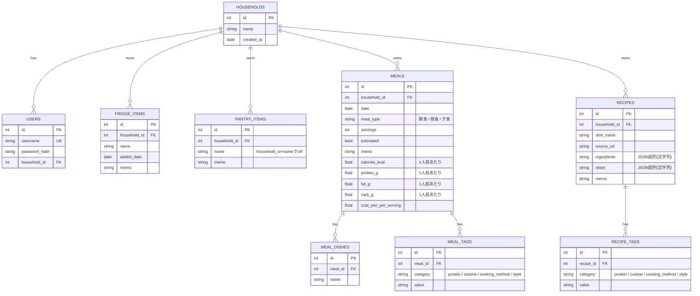

# データモデル

`app/models.py`(SQLAlchemy)で定義しているSQLiteのテーブル定義。コードが正であり、このドキュメントはその要約。フィールドを変更したら、このドキュメントも一緒に更新すること。

## ER図

## テーブル詳細

### households(世帯・共有スコープ)
冷蔵庫・常備品・献立・レシピの「持ち主」の単位。個人利用時も、ユーザー作成時に1人=1世帯を自動作成する(`scripts/create_user.py`)。将来的に家族で共有したくなったら、複数の`users`を同じ`household_id`に束ねるだけでよい設計(2026-09-15〜)。

| カラム | 型 | 説明 |
|---|---|---|
| id | int (PK) | |
| name | string | 世帯名(自動生成、例: "aliceの世帯") |
| created_at | date | |

### users(ログインユーザー)
個人利用のみ想定のため、公開の登録エンドポイントはなく`scripts/create_user.py`から作成する。認証(JWT発行・検証)の主体であり、`household_id`を通じて所属する世帯のデータにアクセスする。1ユーザーは1世帯にのみ所属する(複数世帯への同時所属は非対応、必要になれば中間テーブルへの拡張を検討)。

| カラム | 型 | 説明 |
|---|---|---|
| id | int (PK) | |
| username | string (unique) | |
| password_hash | string | bcryptハッシュ |
| household_id | int (FK → households.id) | 所属する世帯 |

### fridge_items(冷蔵庫の中身)
今ある食材のみを保持する(消費履歴は残さない)。使い切ったら行ごと削除する運用。`household_id`が同じユーザー同士で共有される。

| カラム | 型 | 説明 |
|---|---|---|
| id | int (PK) | |
| household_id | int (FK → households.id) | |
| name | string | 食材名 |
| added_date | date | 追加日 |
| memo | string | 任意メモ |

### pantry_items(常備品)
調味料・乾物など、常にある前提のもの。`(household_id, name)`の組み合わせでユニーク制約(世帯ごとに同名アイテムは1つ)。

| カラム | 型 | 説明 |
|---|---|---|
| id | int (PK) | |
| household_id | int (FK → households.id) | |
| name | string | 常備品名 |
| memo | string | 任意メモ |

### meals(献立記録)
1件が1回の食事(朝食/昼食/夕食)に対応。**栄養・材料費は献立1人前あたりの値**であり、品目ごとの内訳は持たない([`ai-project/menu`](../../menu)の実データ構造(`meals.json`)に合わせた設計)。

| カラム | 型 | 説明 |
|---|---|---|
| id | int (PK) | |
| household_id | int (FK → households.id) | |
| date | date | |
| meal_type | string | `朝食` / `昼食` / `夕食` |
| servings | int | 人前 |
| estimated | bool | 栄養・材料費が概算値かどうか |
| memo | string | |
| calories_kcal / protein_g / fat_g / carb_g | float | 1人前あたりの栄養価 |
| cost_yen_per_serving | float | 1人前あたりの材料費概算 |

### meal_dishes(献立を構成する品目)
`meals`に対する1:N。品目は名前のみ(栄養価は持たない)。

| カラム | 型 | 説明 |
|---|---|---|
| id | int (PK) | |
| meal_id | int (FK → meals.id) | |
| name | string | 料理名 |

### meal_tags(献立のタグ)
`meals`に対する1:N。1つの献立が複数カテゴリ・複数値のタグを持てる(例: `protein`に`豚肉`と`卵`の両方)。語彙は[`ai-project/menu/data/tags.json`](../../menu/data/tags.json)を踏襲。

| カラム | 型 | 説明 |
|---|---|---|
| id | int (PK) | |
| meal_id | int (FK → meals.id) | |
| category | string | `protein` / `cuisine` / `cooking_method` / `style` |
| value | string | 語彙内の値 |

### recipes(お気に入りレシピ)
CRUD実装済み(2026-09-14〜)。`dish_name`は`meal_dishes.name`と文字列一致する想定だが、DB上の外部キー制約はない(命名のゆらぎがあり得るため)。`ai-project/menu/recipes/*.md`からの移行スクリプト(`scripts/migrate_recipes.py`)あり。

| カラム | 型 | 説明 |
|---|---|---|
| id | int (PK) | |
| household_id | int (FK → households.id) | |
| dish_name | string | 料理名 |
| source_url | string | 出典URL(あれば) |
| ingredients | string | 材料リスト(JSON配列を文字列として保存) |
| steps | string | 手順リスト(JSON配列を文字列として保存) |
| memo | string | 任意メモ(出典行以外の地の文・補足など) |

### recipe_tags(レシピのタグ)
`recipes`に対する1:N。`meal_tags`と同じ構造・語彙(`protein`/`cuisine`/`cooking_method`/`style`)。`style`は「本格」か「時短」かの目線で分類する。

| カラム | 型 | 説明 |
|---|---|---|
| id | int (PK) | |
| recipe_id | int (FK → recipes.id) | |
| category | string | `protein` / `cuisine` / `cooking_method` / `style` |
| value | string | 語彙内の値 |
