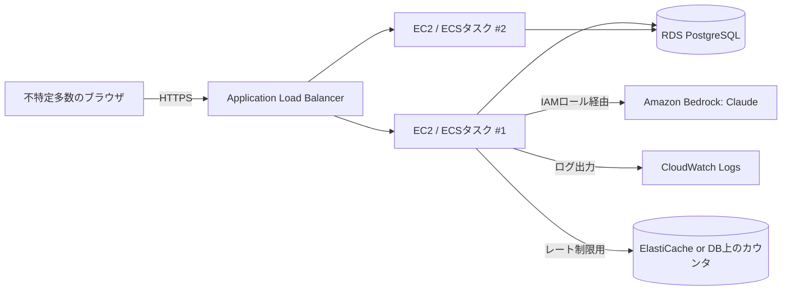

# AWS構成案

mogumiを外部公開するための、AWS上の構成案。詳細な検討経緯は [Issue #4](https://github.com/Kedama515/mogumi/issues/4) を参照。

## 前提・方針

- 公開は「フェーズ1: 限定公開(知人向け)」→「フェーズ2: 本格公開(不特定多数サインアップ、[Issue #47](https://github.com/Kedama515/mogumi/issues/47))」の2段階で進める
- 基盤はAWSに統一する。理由は主に、フェーズ間で基盤ごと乗り換える移行リスクを避けられること、Claude呼び出しをAmazon Bedrock経由にすることでAPIキー管理が不要になること、ログ管理([Issue #48](https://github.com/Kedama515/mogumi/issues/48))もCloudWatch Logsでカバーできること
- 予算目安: 月$30程度(EC2代+Bedrock従量課金込み)。AWS無料利用枠は使用済みの前提でコストを見積もる
- Claude呼び出しは `Anthropic` SDKの直接呼び出しから、Amazon Bedrock経由(`AnthropicBedrock`クライアント等)に切り替える。実装時は最新のドキュメントでモデルID・SDK仕様を確認すること(記憶に頼らない)

## フェーズ1: 限定公開(知人向け)

```mermaid
flowchart LR
    User[知人のブラウザ] -->|HTTPS| ALB_OR_DIRECT[EC2: nginx]
    subgraph EC2インスタンス [EC2 (t4g系, ARM)]
        nginx[nginx] --> frontend[frontend静的ビルド]
        nginx --> backend[uvicorn: FastAPI]
        backend --> sqlite[(SQLite on EBS)]
    end
    backend -->|IAMロール経由| Bedrock[Amazon Bedrock: Claude]
    backend -->|ログ出力| CloudWatch[CloudWatch Logs]
```

### 構成要素

| 要素 | 内容 |
|---|---|
| コンピュート | EC2インスタンス1台(t4g.micro〜t4g.small、ARM/Graviton。Python・Node.jsともARM対応ビルドあり) |
| ストレージ | EBSボリューム(gp3、10〜20GB程度)に`mogumi.db`(SQLite)を配置 |
| Webサーバー | nginxでリバースプロキシ。`/api`はuvicorn(FastAPI)へ、それ以外は`frontend`のビルド済み静的ファイルを配信 |
| HTTPS | Let's Encrypt(certbot)でnginxに証明書を設定。独自ドメインを使う場合はRoute 53で管理してもよいし、レジストラのDNSのままでも可 |
| Claude呼び出し | EC2インスタンスにBedrock呼び出し用のIAMロールをアタッチ(`bedrock:InvokeModel`等、最小権限に絞る)。`ANTHROPIC_API_KEY`のようなシークレットをサーバー上に置く必要がなくなる |
| ログ | アプリのログを`logging`モジュール経由でCloudWatch Logsに送る(#48と合わせて実装) |
| ユーザー管理 | 現状どおり`scripts/create_user.py`で作成、または#46のサインアップ機能を使う |

### なぜこの構成か

- SQLiteはファイルベースのDBなので、永続化されたディスク(EBS)を持つ通常のEC2インスタンスと相性が良い。コンテナ/サーバーレス(ECS Fargate, Lambda等)は起動のたびにファイルシステムがリセットされる構成が多く、素直に載せるとデータが消えるためフェーズ1では避ける
- EC2 1台+nginxという最小構成にすることで、知人数人向けの検証段階に見合った運用コスト・金銭コストに抑える
- IAMロールでのBedrockアクセスは、EC2インスタンス自体が既にAWSの権限管理下にあるため、追加のシークレット管理の手間なく実現できる

### 概算コスト(フェーズ1、無料利用枠なし)

| 項目 | 目安 |
|---|---|
| EC2(t4g.micro、24時間稼働) | 月 $5〜8 |
| EBS(gp3 20GB) | 月 $1〜2 |
| Bedrock(Claude、知人数人の利用量) | 月 $1〜5程度(要実測) |
| データ転送量(小規模なら無料枠内に収まる想定) | ほぼ$0 |
| **合計目安** | **月 $10〜20程度**(予算上限$30に収まる) |

## フェーズ2: 本格公開(不特定多数サインアップ、#47と連動)

フェーズ1のEC2インスタンスは維持しつつ、以下を段階的に足していくイメージ。基盤を乗り換えるのではなく、同じAWSアカウント内で拡張する。



### フェーズ1からの主な変更点

| 項目 | フェーズ1 | フェーズ2 |
|---|---|---|
| DB | EC2上のSQLite | RDS PostgreSQL(複数ユーザーの同時書き込みに対応) |
| コンピュート | EC2 1台 | ALB配下でEC2複数台 or ECS Fargateでスケール(必要になってから) |
| レート制限 | なし | プラン別(`users.plan`)の上限をアプリ側で実装。カウンタの保存先はRDSか、必要ならElastiCache(Redis) |
| 監視 | 最低限のCloudWatch Logs | CloudWatchアラーム(エラー率・レイテンシ・コスト)を追加 |
| その他 | - | #47の各項目(利用規約・パスワードリセット・メール確認等)に対応 |

このフェーズへの移行は、実際に不特定多数向けサインアップを始めるタイミングで着手する(現時点では設計メモのみ)。

## セキュリティ設計メモ

- EC2のセキュリティグループは、80/443(HTTP/HTTPS)のみを外部公開し、SSH(22番)は自分のIPからのみに制限する
- IAMロールはBedrock呼び出しに必要な権限(`bedrock:InvokeModel`など)のみを付与し、他のAWSサービスへの権限は持たせない(最小権限の原則)
- `MOGUMI_SECRET_KEY`(JWT署名鍵)は引き続き環境変数で管理し、AWS Systems Manager Parameter StoreやSecrets Managerへの格納も検討する(フェーズ2で本格検討)

## 未確定・今後決めること

- 独自ドメインを取得するかどうか(取得する場合はRoute 53 or 外部レジストラ+DNS設定) → [Issue #51](https://github.com/Kedama515/mogumi/issues/51)
- フェーズ1のインスタンスサイズ(t4g.micro / t4g.small)は実際の負荷を見ながら調整 → [Issue #52](https://github.com/Kedama515/mogumi/issues/52)
- レート制限の実装方式の詳細 → [Issue #47](https://github.com/Kedama515/mogumi/issues/47)
